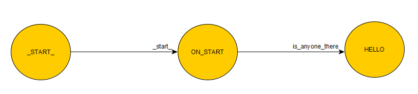

# Python Automata-Based Programming Paradigm

### Short introduction to the project

Presenting my Python programming paradigm with which we can separate the application into several parts:

- Behaviour
- Execution
- MainLoop

Many of the people reading this might think: _"Hey, but MainLoop **is** the behaviour and execution as well"_ and you would be right.
However, do allow me to elaborate on this. My reasoning is that everything should be simplified if it can be.

The goal here is actually to define some behaviour parts of your program in easy to read graphs and only write the execution parts in the code.
This way you can concentrate on writing code for your main loop only.

Naturally, everything is better when there is an example with it to explain it even more so I recommend you check [the examples](#additional-links) in the repository first.

### A short explanation of the project

To really simplify what this is all about in one sentence: ___"Instead of programming the code yourself you draw graphs to define the behaviour."___

These graphs are loaded when first executing your code and are _automatically_ connected to their execution part.

Each graph is called a machine, and each execution is called a state. (Yes, there can be several machines working consecutively at the same time)

To get a better idea of what's going on here's a quick example. Using a [__yEd Graph Editor__][4] Create a .graphml graph like this one and store it in the _graphs/_ folder of your project as _first.graphml_ .



Run the next code: (don't forget to clone the repository into your project folder)

```python
import automatabpp as FSM

FSM.BEHAVIOUR.load_behaviour_from_graph("first.graphml", "My First Finite State Machine")

@FSM.EXECUTION.state
def ON_START(*args, **kwargs):
    print("FSM start")

@FSM.EXECUTION.state
def HELLO(*args, **kwargs):
    print("Hello!")

FSM.OPERATION.start_fsm()                   # prints "FSM start"
FSM.OPERATION.run_fsm("is_anyone_there")    # prints "Hello!"
```

To learn more please check [the examples at the bottom of the page](#additional-links).

***

### Why a paradigm and not a pattern?

While developing this project I ran into this quote on [wikipedia][1]. To quote:

> "Automata-based programming is a programming paradigm in which the program or part of it is thought of as a model of a finite state machine (automatabpp) or any other (often more complicated) formal automaton."

There is also a [definition on programming paradigm][2] that I found fitting this project perfectly.

> "A programming paradigm is a style, or “way,” of programming."

Indeed, there is more than enough style in developing this way once you learn how to do it.

### How does this differ from ... ?

There are countless ways to develop your program and this one is just one take on it.
However I do feel there are some advanteges to using the Automata-Based programming over some other approach.
* Explanation of the code can be easily visualized since most of the code is done by drawing graphs
* If the machines are well defined the execution and the main loop can be really simple
* __It's fun__ _(if you consider drawing FSMs to be fun)_

I'll also leave these [two quotes here][3]:
> "Programs must be written for people to read, and only incidentally for machines to execute." - Abelson & Sussman

> "Typing is no substitute for thinking." - Richard W. Hamming

### What other software do I need ?
I would recommend you download the [yEd Graph Editor from their official homepage][4]. This project can only import ___.graphml___ graphs at the moment.
However I do plan on adding code to import more formats in the future.

__yEd Graph Editor__ is used for viewing and drawing our state machine graphs.
We consider nodes of the graph to be the states and the edges to be the transitions.

I also recommend using **Python 3.4+** although I haven't even tried it yet on the older versions. This project uses `logging` and `xml` Python modules so install them if needed.

### Directories

* **./automatabpp/** - our module source code. This directory contains the python code for this project.
* **./docs/** - I've really took my time to write all of this so I would appreciate you checking it out
* **./graphs/** - yEd graphs are stored in this directory by default

### Additional Links

Here are some other .md links for You to read about this project.
* [A list of available functions](docs/FSM.md)
* [Tutorial](docs/tutorial.md) - make a _"Hello, World!"_ type of application (sort of). Also some more insight on what happens in the code itself.
* [Example 1](docs/examples/example1.md) - a simple e-mail validation machine
* [Example 2](docs/examples/example2.md) - an example for developing with multiple machines
* [Example 3](docs/examples/example3.md) - an example showcasing Base64 encode with this paradigm
* [Example 4](docs/examples/example4.md) - developing your embedded application with _complex_ behaviour
* [Other](docs/other.md)


[1]: https://en.wikipedia.org/wiki/Automata-based_programming "Automata-based programming"
[2]: https://cs.lmu.edu/~ray/notes/paradigms/ "Programming Paradigms"
[3]: https://en.wikiquote.org/wiki/Programming_languages "Wikiquote - Programming languages"
[4]: https://www.yworks.com/products/yed "yWorks Homepage"
