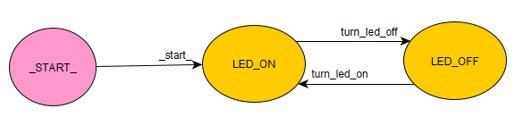
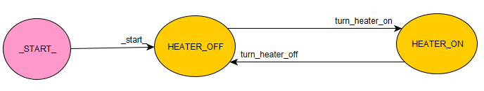
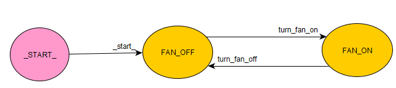
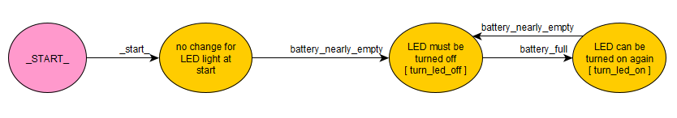
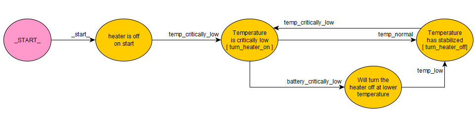
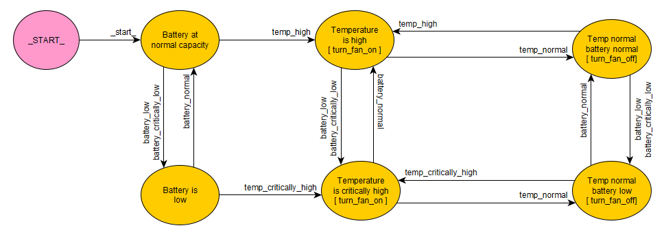

# Example 4

This is, in my opinion, the most interesting example for using the FSMs. You can check the source code in the [example4.py][pycode] script.

We will be using the next graphs for the project:
- _embedded/fan.graphml_
- _embedded/heater.graphml_
- _embedded/led_light.graphml_
- _embedded/fan_model.graphml_
- _embedded/heater_model.graphml_
- _embedded/led_light_model.graphml_

| [BACKGROUND](#background) | [GRAPH](#graph) | [CODE OVERVIEW](#code-overview)| [OTHER](#other) |
| --- | --- | --- | --- |

### Background

Imagine developing for some embedded device (or similar) project. You are given a task of developing your application with a number of sensors and output devices.

In this example you are given a battery, a temperature sensor, a LED light, a heater and a cooler fan. Now your task is to control your device in such a way that:
* LED light
  - is __always on__ unless the battery is nearly empty
  - if the battery is nearly empty __turn off__ the LED
  - LED can __turn on__ again only if the battery is at __full capacity__ again
* Heater
  - only __turned on__ if the temperature reaches a __critical low__ value
  - once it's __turned on__, it can only __turn off__ if the temperature reaches some __normal__ value
  - if the battery is currently at a __low capacity__ lower the temperature value for turning off the heater
* Cooler
  - must be __off__ unless the temperature reaches a __high temperature__
  - if it has been __turned on__ wait until the temperature reaches __normal__ value and turn it __off__
  - if the battery is at a low capacity currently it only turns __on__ if the temperature reaches __critical__ value

This behaviour is quite simple for explaining it in a normal conversation, however... What about the code?
- is it readable?
- is it simple to change? Does it cause spaghetti code? 
- is it easily explainable? What about documentation?
- is it fast?
- what about some other code that also needs to be implemented by this application? (Usually this kind of behaviour is only a part of what your application needs do)

Let's see how this module tries to tackle this problem and answer all the questions above yourself. You can also try writing the code for this problem yourselves. Put whichever values you wish for the thresholds.

### Graph

Next couple of graphs should be obvious:

_embedded/led_light.graphml_



_embedded/heater.graphml_



_embedded/fan.graphml_



These graphs will only serve as an endpoint for our execution functions. One thing to notice is that you can only turn on the device once. There is no possibility of turning the device again while it is already turned on.
<br>Since the default state for LED light is to always be on we will set it to be on while starting.

Now let's draw the behaviour of our components.

_embedded/led_model.graphml_



This one should be somewhat obvious. I guess the graph is self explanatory, but there is one more question you might ask. How is this connected to the previous LED graph?
<br>Well, the answer is that this graph on the execution of states **`LED must be turned off [ turn_led_off ]`** and **`LED can be turned on again [ turn_led_on ]`** sends the commands `turn_led_off` and `turn_led_on` respectively to the `CommandQueue` for later execution, and if you look at the led graph you might see how these two are connected.

The same line of thinking is applied to the _embedded/heater_model.graphml_ 



and _embedded/fan_model.graphml_



These _model_ graphs are now actually a higher abstract layer of their low level counterparts. They define behaviour which can be easily read from the graphs.

Let's see how this is implemented in our code.

### Code Overview

You can check the code in the [example4.py][pycode] script.

- First let's take care of importing everything we will need:
    ```python
    from automatabpp import *
    from comparisons import COMPARISONS # a helper class for comparison lambda functions
    import math, time                   # we'll use this to simulate our readings
    ```

- Let's define our low-level executions:
    ```python
    class LED:
        BEHAVIOUR.load_behaviour_from_graph("embedded/led_light.graphml", "Embedded LED Light machine")

        @EXECUTION.state
        def LED_ON(**_):
            print("Turning LED on")

        @EXECUTION.state
        def LED_OFF(**_):
            print("Turning LED off")

    class FAN:
        BEHAVIOUR.load_behaviour_from_graph("embedded/fan.graphml", "Embedded Fan machine")

        @EXECUTION.state
        def FAN_ON(**_):
            print("Turning fan on")

        @EXECUTION.state
        def FAN_OFF(**_):
            print("Turning fan off")

    class HEATER:
        BEHAVIOUR.load_behaviour_from_graph("embedded/heater.graphml", "Embedded Heater machine")

        @EXECUTION.state
        def HEATER_ON(**_):
            print("Turning heater on")

        @EXECUTION.state
        def HEATER_OFF(**_):
            print("Turning heater off")
    ```
    There's a couple of things to note here:
    - This kind of code is at the same time, somehow, pythonic and not pythonic. By using classes we connect the code visually however we won't be using any of these classes in the code, rather we'll let the automatabpp take care of calling them.
    - We only simulate turning on/off of these devices by printing it
- Now we load the higher level abstract behaviour that will drive these machines
    ```python
    BEHAVIOUR.load_behaviour_from_graph("embedded/led_light_model.graphml", "Model for LED light behaviour")
    BEHAVIOUR.load_behaviour_from_graph("embedded/heater_model.graphml", "Model for heater behaviour")
    BEHAVIOUR.load_behaviour_from_graph("embedded/fan_model.graphml", "Model for fan behaviour")
    ```
    Note that we don't actually need to connect any of these to their execution part.
- Let's define the code for our sensor reading:
  ```python
  @INTERFACE.run_command_if_lambda_on_result_true(COMPARISONS.less_than(3.2), "battery_critically_low")
  @INTERFACE.run_command_if_lambda_on_result_true(COMPARISONS.between(3.2, 3.5), "battery_low")
  @INTERFACE.run_command_if_lambda_on_result_true(COMPARISONS.between(3.501, 4.2), "battery_normal")
  @INTERFACE.run_command_if_lambda_on_result_true(COMPARISONS.more_than(4.2), "battery_full")
  @INTERFACE.run_command_if_lambda_on_result_true(COMPARISONS.less_than(3.5), "battery_nearly_empty")
  def simulate_battery_voltage_reading(num):
      return (math.sin(num)+1)*2.5

  @INTERFACE.run_command_if_lambda_on_result_true(COMPARISONS.less_than(-5), "temp_critically_low")
  @INTERFACE.run_command_if_lambda_on_result_true(COMPARISONS.between(-5, 0), "temp_low")
  @INTERFACE.run_command_if_lambda_on_result_true(COMPARISONS.between(1, 50), "temp_normal")
  @INTERFACE.run_command_if_lambda_on_result_true(COMPARISONS.between(51, 62), "temp_high")
  @INTERFACE.run_command_if_lambda_on_result_true(COMPARISONS.more_than(62), "temp_critically_high")
  def simulate_temperature_reading(num):
      return (math.sin(2*pow(num, 2))+1)*50-20
  ```
  Here is where our `COMPARISONS` class comes into play. Every function in the class is actually a `lambda` that returns `True` if the input is what the function says.

  For example: every time we call the `simulate_temperature_reading` function and its return value is in between 1 and 50 the command `temp_normal` will be added to the `CommandQueue` for later execution.
- Only thing left to do is to run the automatabpp and simulate reading values:
  ```python
  OPERATION.start_fsm()

  for i in range(100):
      volt = round(simulate_battery_voltage_reading(i), 2)      # simulate reading the voltage sensor
      temp = round(simulate_temperature_reading(i), 2)          # simulate reading the temperature sensor
      print("\t\t|\t{}V\t|\t{}°C".format(volt, temp))
      OPERATION.run_fsm()                                       # run commands left in the CommandQueue
      time.sleep(1)
  ```

The rest of the code doesn't ever need to care about the behaviour of our components. The only thing that we need to do is read the sensor from time to time and run the commands left in the CommandQueue and the automatabpp will take care of everything else.
<br>Our code has just gotten a lot simpler after this and we can take care of whichever other things we want to do in the application.

### Other

What we've learned here:
* The graphs can be modeled so that they offer a few layers of abstraction of their low-level behaviour
* There is no need to make lots of spaghetti code in our main program when we can substitute all that complexity with a couple of well defined graphs
* We've separated our code into:
  - reading the sensors - _additionaly we only say what those values should represent to the machines_
  - executing basic tasks (turning stuff on/off, ...) - _these should be as simple as they can get_
  - other important stuff we have to do - the behaviour is defined completely in graphs so it leaves more place for other things to be done
* additionally, there were some _code-readability tricks_ in Python I've showed you that you could use with this module

This has been a long example to follow but I hope you've made it through. You might even think that this is too much to do given the task was relatively easy. However also consider what the alternative to this would be. Could it fit in only 76 lines of code and be as readable as it is now?

| [Back to Example 3][prev] | ----- | [Go to Main][next] |
| --- | --- | --- |


[pycode]: ../../example4.py "pycode"
[prev]: example3.md "Example 3"
[next]: ../../README.md "Main"
