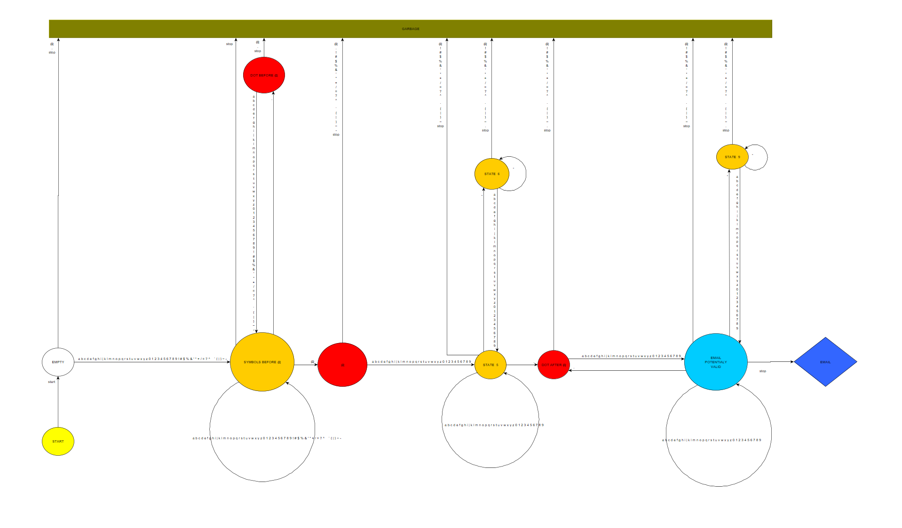

# Example 1

Here is an explanation of [example1.py][pycode] script you can run.

| [BACKGROUND](#background) | [GRAPH](#graph) | [CODE OVERVIEW](#code-overview)| [OTHER](#other) |
| --- | --- | --- | --- |

### Background

One of the basic uses of FSMs is regex validation, and one of the most used regex validations is e-mail address validation.

[This stack overflow answer][1] sheds some light on what regex we should use to check if an e-mail is valid or not.

What I will do here is walk you through implementing a simple automatabpp overcoming this problem.

### Graph

Here is the graph from the above mentioned stack overflow answer:


I guess this graph could have been made somewhat simpler but this is not of interest at the moment.
What we will do is implement just the upper half of this graph as we really don't want to deal with some weird ASCII characters currently.

The image of our state machine that implements this behaviour can be seen on the next picture. It is located in the _graphs_ folder under the name _email/email.graphml_



Be sure to check how the transitions are defined. If we want to use multiple commands between the same state we only need to separate it by spaces or newlines.

If the validation fails at any step the state of the machine will be `GARBAGE` and if this has been our last character to check we only need to send the `_stop_` command to see if the result is an e-mail or not.


### Code Overview

Let's see how this is implemented in the [example1.py][pycode] script.


- We import all the automatabpp module classes:
    ```python
    from automatabpp import *
    ```
- This is a function we will use to shorten the code:
    ```python
    def test_email():
        for char in email_to_test:
            OPERATION.run(char)
        OPERATION.stop()
    ```
    What this means is we will take one by one character from the e-mail and run it through our machine. At the very end we will send the `_stop_` command to let the automatabpp know we're done.

- Here comes our graph loading and execution definitions. The `EXECUTION.state` decorator connects the function to the state with the same name in the graph:
    ```python
    BEHAVIOUR.load_behaviour_from_graph("email/email.graphml", "E-Mail validation machine")

    @EXECUTION.state
    def GARBAGE(**_):
        print("{} IS NOT A VALID EMAIL".format(email_to_test))

    @EXECUTION.state
    def EMAIL(**_):
        print("{} IS A VALID EMAIL".format(email_to_test))
    ```
    We are only interested in two states here: "Is it, or is it not, a valid e-mail?"

- Let's run the machine and check our first e-mail address:
    ```python
    OPERATION.start()

    email_to_test = "a_valid@email.example"
    test_email()
    ```
- Once we're done we can restart the machine since it is currently in __EMAIL__ state and check another e-mail address:
    ```python
    OPERATION.reset()

    email_to_test = "an._invalid@email@example-"
    test_email()
    ```

If we run our code we should see the following in the console:
```console
user@computer:~$ python example1.py
a_valid@email.example IS A VALID EMAIL
an._invalid@email@example- IS NOT A VALID EMAIL
user@computer:~$
```

### Other

Let's check a couple of things we've learned here:
* We don't need to define every state execution in the code
* The FSMs can be reset at any time
* We can define multiple transitions using the same edge in a graph


| [Back to Tutorial][prev] | ----- | [Example 2][next] |
| --- | --- | --- |

[1]: https://stackoverflow.com/questions/201323/how-to-validate-an-email-address-using-a-regular-expression "E-Mail regex"
[pycode]: ../../example1.py "pycode"
[prev]: ../tutorial.md "Tutorial"
[next]: example2.md "Example 2"
