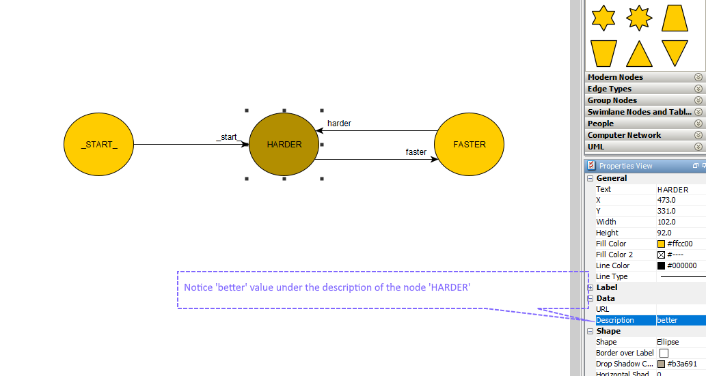
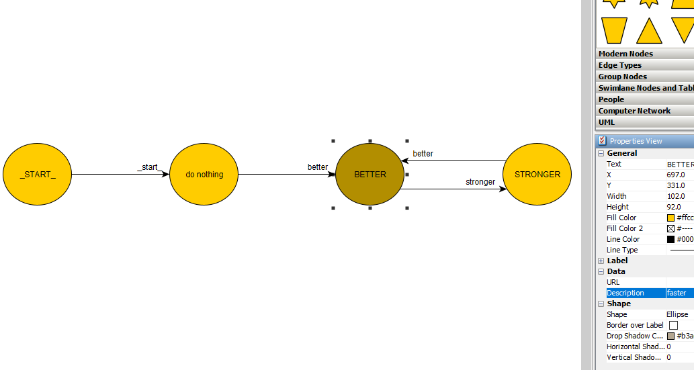

# Example 2

I needed a simple example of how the machines can work and communicate together so I came up with this one. Check the code at [example2.py][pycode] .

| [BACKGROUND](#background) | [GRAPH](#graph) | [CODE OVERVIEW](#code-overview)| [OTHER](#other) |
| --- | --- | --- | --- |

### Background

It might not be obvious so far but there can be multiple machines parsing commands at the same time. They can even
command each other what to do next, and all that without having to write a single line of py code (other than importing and running the automatabpp).

### Graph

Let's see the two graphs we will be using this time. The first one is called _hbfs/harderfaster.graphml_



I've already put a note in the image about what you should note this time. The node `HARDER` has the value `better` in it's description. What this means is that once the state `HARDER` is executed the command `better` will be added to the `CommandQueue` for later execution.

State `FASTER` also has a similar description named `stronger`.

Let's check the graph under _hbfs/betterstronger.graphml_



The graph is almost the same with the only difference of one additional state.
This state is added so the two graphs are balanced and don't start at the same time.


### Code Overview

Let's see how this is implemented in the [example2.py][pycode] script.


- We import all the automatabpp module classes:
    ```python
    from automatabpp import *
    ```
- Let's define a function for printing everything in the same line but with a delay:
    ```python
    def print_w_timeout(text: str):
        import time
        print("\r {}".format(text), end="")
        time.sleep(0.6)
    ```

- Load the first graph:
    ```python
    BEHAVIOUR.load_behaviour_from_graph("hbfs/harderfaster.graphml", "HARDER/FASTER")

    @EXECUTION.state
    def HARDER(**_):
        print_w_timeout("Work it harder")

    @EXECUTION.state
    def FASTER(**_):
        print_w_timeout("Do it faster")
    ```
    The execution is just printing with our custom print function.

- Do the same for the second graph:
    ```python
    BEHAVIOUR.load_behaviour_from_graph("hbfs/betterstronger.graphml", "BETTER/STRONGER")

    @EXECUTION.state
    def BETTER(**_):
        print_w_timeout("make it better")

    @EXECUTION.state
    def STRONGER(**_):
        print_w_timeout("makes us stronger")
    ```

- All that's left is to run the machine:
    ```python
    OPERATION.start()
    OPERATION.run()
    ```
    One thing to note here is that the `OPERATION.run()` is executed here without any argument.
    That means it will run all the commands in the `CommandQueue` until the queue is empty.
    
Run the code and see what you get.
```console
user@computer:~$ python example2.py
```

### Other

Let's check a couple of things we've learned here:
* We can define multiple graphs at the same time
* The after-execution-commands can also be defined in the graph
* Graphs defined in this way can be stuck in an infinite loop

| [Back to Example 1][prev] | ----- | [Example 3][next] |
| --- | --- | --- |

[pycode]: ../../example2.py "pycode"
[prev]: example1.md "Example 1"
[next]: example3.md "Example 3"
