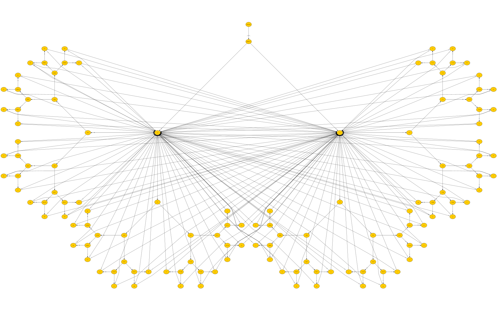

# Example 3

Let's check how else we can play with the state machines in an [example3.py][pycode] script.

| [BACKGROUND](#background) | [GRAPH](#graph) | [CODE OVERVIEW](#code-overview)| [OTHER](#other) |
| --- | --- | --- | --- |

### Background

Encoding data to base64 format is something that is done rather easy today. Let's show one correct way to do that (although not best by even a long shot).

If you're not familiar with what base64 it's always good to check the [Wikipedia page about it][1] first.

### Graph

Let's look at the graph:



This is the machine that converts raw bytecode (bitcode actually) into base64. It's also not complete as it takes into account that the length of the bitcode is a multiple of 6. A complete graph would require 20 more states and 20 more transitions but this graph was already too big even without it (128 states and 256 transitions).

### Code Overview

Let's see how this is implemented in the [example3.py][pycode] script.


- We import all the automatabpp module classes:
    ```python
    from automatabpp import *
    ```
- We will need a function that converts string directly to bits:
    ```python
    def text_to_bits(text, encoding='utf-8', errors='surrogatepass'):
        import binascii
        bits = bin(int(binascii.hexlify(text.encode(encoding, errors)), 16))[2:]
        return bits.zfill(8 * ((len(bits) + 7) // 8))
    ```
    Each bit will be a command we will call the machine with.

- We are interested in exactly 64 functions here, so it's a bad idea to define them all by hand. It might be better to create them dynamically:
    ```python
    def dynamically_create_function(name):
        def created(**_):
            print(created.__name__, end="")
        created.__name__ = name
        return EXECUTION.state(created)
    ```
    We will create a function which will only print itself and automatically call the decorator over it.

- Now let's load the graph and define 64 functions from the graph
    ```python
    BEHAVIOUR.load_behaviour_from_graph("base64/encode.graphml", "Base64 encode machine")

    for char in "ABCDEFGHIJKLMNOPQRSTUVWXYZabcdefghijklmnopqrstuvwxyz0123456789+/":
        dynamically_create_function(char)
    ```
    That's right, we defined a function called `+` and a function called `/`. Python is a great language.

- Start the machine, run the bytecode through it and every 456 characters print a new line:
    ```python
    OPERATION.start_fsm()

    example = "Man is distinguished, not only by his reason, but by this singular passion from other animals, " \
            "which is a lust of the mind, that by a perseverance of delight in the continued and indefatigable " \
            "generation of knowledge, exceeds the short vehemence of any carnal pleasure."

    for i, char in enumerate(text_to_bits(example)):
        OPERATION.run_fsm(char)
        if i > 0 and i % (8*57) == 0:
            print()
    ```

If we run our code we should see the following in the console:
```console
user@computer:~$ python example3.py
TWFuIGlzIGRpc3Rpbmd1aXNoZWQsIG5vdCBvbmx5IGJ5IGhpcyByZWFzb24sIGJ1dCBieSB0aGlz
IHNpbmd1bGFyIHBhc3Npb24gZnJvbSBvdGhlciBhbmltYWxzLCB3aGljaCBpcyBhIGx1c3Qgb2Yg
dGhlIG1pbmQsIHRoYXQgYnkgYSBwZXJzZXZlcmFuY2Ugb2YgZGVsaWdodCBpbiB0aGUgY29udGlu
dWVkIGFuZCBpbmRlZmF0aWdhYmxlIGdlbmVyYXRpb24gb2Yga25vd2xlZGdlLCBleGNlZWRzIHRo
ZSBzaG9ydCB2ZWhlbWVuY2Ugb2YgYW55IGNhcm5hbCBwbGVhc3VyZS
user@computer:~$
```

### Other

Although there are a lot of better ways to encode to base64, ask yourselves this: _Are they easier to explain to somebody who is not familiar with the topic?_

What we've learned here:
* Machines can get really big
* We can somehow define even the really strangely named functions
* Sometimes reinventing the wheel takes you to the same place, although a bit slower
* The graph for decoding from base64 would have 384 more states. I'll just leave this here

| [Back to Example 2][prev] | ----- | [Example 4][next] |
| --- | --- | --- |

[1]: https://en.wikipedia.org/wiki/Base64 "Base64 Wikipedia"
[pycode]: ../../example3.py "pycode"
[prev]: example2.md "Example 2"
[next]: example4.md "Example 4"
