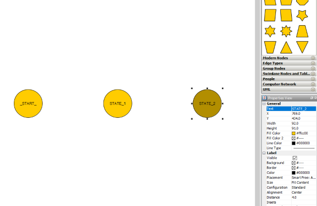
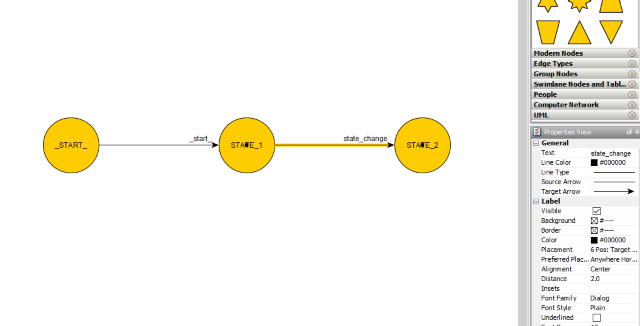

# A short tutorial on using the FSM

One of the prerequisites for using this module is knowing how the [Finite State Machines][1] behave.

It's also important to set some ground rules which all of the machines should share.

| [DEFINITIONS](#definitions) | [RULES](#rules) | [TUTORIAL](#tutorial)| [OTHER](#other) |
| --- | --- | --- | --- |

### Definitions

`Machine` is a graph defining the behaviour we want to achieve. It consists of a finite number of __states__, __transitions__ and optionally a list of __commands__
to be added to the __CommandQueue__ after the state execution. (In __yEd Graph Editor__ a machine is the graph itself)

`State` is a single graph node which can be connected to it's __execution__ counterpart. Each state can also have optionally a list of __commands__
to be added to the __commandQueue__ after the state execution. (In __yEd Graph Editor__ a State is represented as a node)

`Command` is a string representing the input to the automatabpp. (In __yEd Graph Editor__ a Command is represented as an edge)

`Transition` is a triplet consisting of two __states__ and one __command__ needed for the change of one state to the other. Once the state is changed we consider the transition to have been executed.

`CommandQueue` is a queue (FIFO) holding a list of commands waiting in line to be executed once called.


### Rules

Here are some rules we should consider when developing:

* Commands are either entered directly or through the `CommandQueue` class
* Each state name in the machine __must be unique__
* Each machine begins in state `_START_`
* State `_START_` is never executed
* State `_START_` should have only one transition from itself named `_start_` which takes it to the _real_ machine starting state.
* On every transition we execute the function associated with the next state once and optionally add the associated commands to the top of the `MachineCommands` stack after execution
* Machines are added to the list of the machines in the order they are defined
* Each command executes machines in the order they are defined
* States don't need to have their execution function counterparts. The default state execution in this case is simply `pass`
* _... (I'll probably add more rules in the future)_


### Tutorial

Since everything is better with pictures it might be best to put some here. Let's start with building our first machine.

All we need do is to make a new graphml file in **yEd Graph Editor** and draw three **states**(**nodes**). First state ***must*** be called `_START_` while the other two can be named whatever we want.
Just be sure that the names are unique. In my case the names are `STATE_1` and `STATE_2`. (you can change this in the text area of the 'Properties View')



We will also add some **transitions**(**egdes**). The transition `_START_`->`STATE_1` will be called `_start_` and `STATE_1`->`STATE_2` will be called `state_change`.



Finally we save this graph to the **./graphs/** folder of our project and name it _tutorial.graphml_ .

Now we are ready to start coding.

- First thing that should be on our mind is importing the automatabpp module:
    ```python
    import automatabpp as FSM
    ```
- Next order of business - importing the graph into our code:
    ```python
    FSM.BEHAVIOUR.load_behaviour_from_graph("tutorial.graphml", "TUTORIAL MACHINE")
    ```
    Yes, it's as simple as that. Enter the path and the name of your new machine.

- Now we will override the execution functions of the graph:
    ```python
    @FSM.EXECUTION.state
    def STATE_1(**kwargs):
        print("Executing STATE_1 because command {} was called".format(kwargs["command"]))

    @FSM.EXECUTION.state
    def STATE_2(**_):
        print("Executing STATE_2")
    ```

- We are done with definitions so we can now start our code:
    ```python
    FSM.OPERATION.start()
    ```
    This piece of code actually calls the `_start_` command to be executed on all machines. Additionaly we can call the `state_change` command as well.
    ```python
    FSM.OPERATION.run("state_change")
    ```

If we run our code we should see the following in the console:
```console
user@computer:~$ python tutorial.py
Executing STATE_1 because command _start_ was called
Executing STATE_2
user@computer:~$
```

Hopefully this brief tutorial takes you a step closer to understanding the very basics of this project. The complete code for the python script is:
```python
import automatabpp as FSM

FSM.BEHAVIOUR.load_behaviour_from_graph("tutorial.graphml", "TUTORIAL MACHINE")

@FSM.EXECUTION.state
def STATE_1(**kwargs):
    print("Executing STATE_1 because command {} was called".format(kwargs["command"]))

@FSM.EXECUTION.state
def STATE_2(**_):
    print("Executing STATE_2")


FSM.OPERATION.start()
FSM.OPERATION.run("state_change")
```

### Other

A couple of things we can notice from this is:
* the module recognizes the node names from the graph and connects them to their execution function counterparts
* each overloaded function must take a `dict()` argument before execution. From it we can get the command which initiated the transition
* in the case we don't need to implement the execution of the state transition we can name the state whatever unique name we want to

Feel free to play with the looks and styles of your graphs to make it more readable.

If this short tutorial piqued Your interest be sure to check the examples for some already made short applications.

| [Back to Main][prev] | ----- | [Example 1][next] |
| --- | --- | --- |

[1]: https://en.wikipedia.org/wiki/Finite-state_machine "Finite State Machines Wikipedia"
[prev]: ../README.md "Readme"
[next]: examples/example1.md "Example 1"
